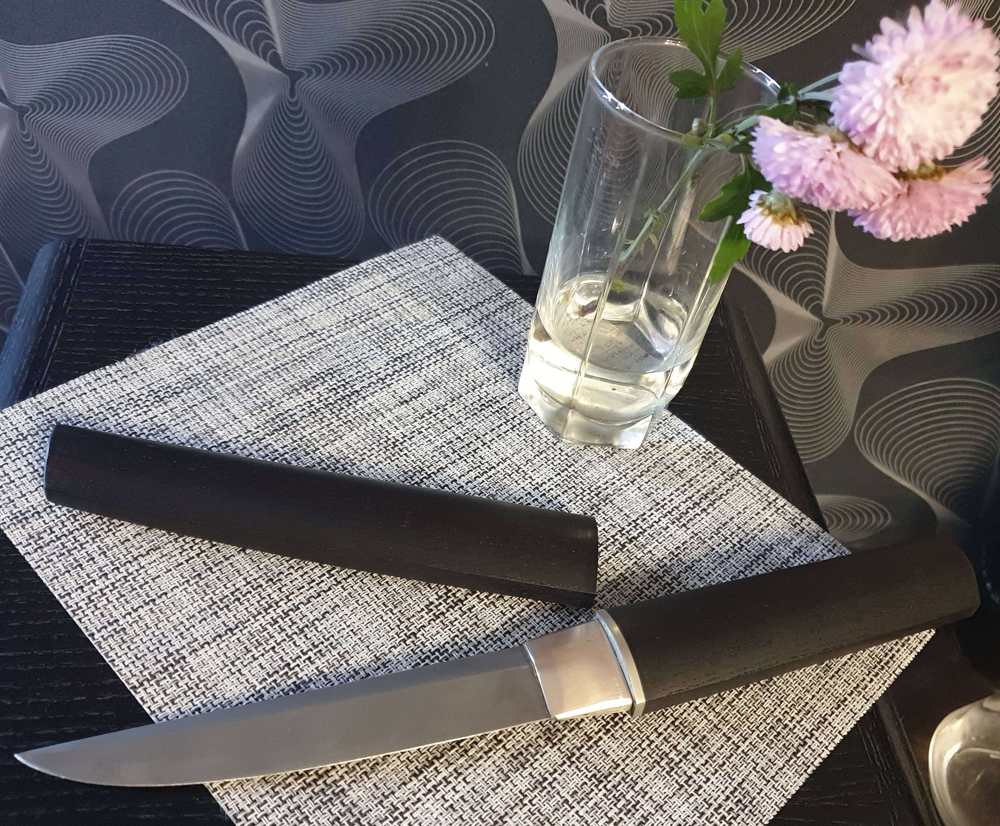
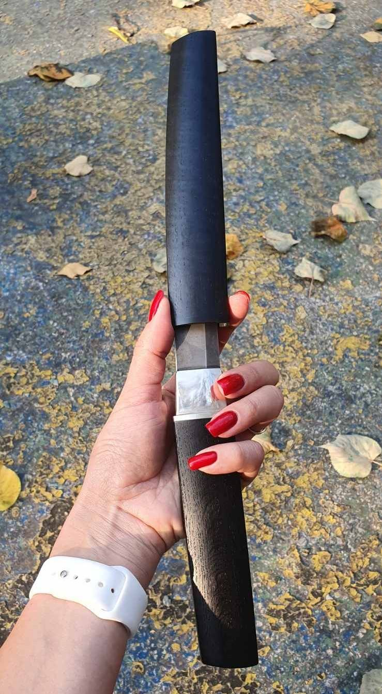
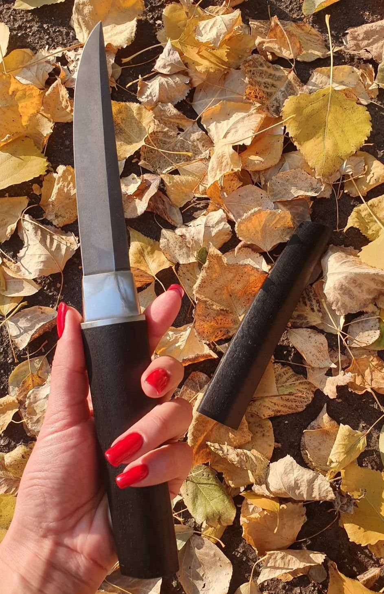

# Інструкція по створенню галереї з кількома фото

## Як об'єднати кілька фото одного ножа в одну картку:

### Замість трьох окремих карток:

```html
<!--  1 -->
<figure class="knife-item">
  
  <figcaption>Ніж «по мотивам Айкуті»: сталь ДІ37, морений дуб, нейзільбер</figcaption>
  <a href="https://youtube.com/shorts/nEc5gzK4ywE?si=hvy43kElnOzXaMBS" target="_blank"><i class="fab fa-youtube"></i> YouTube</a>
</figure>
<!--  2 -->
<figure class="knife-item">
  
  <figcaption>Ніж «по мотивам Айкуті»: сталь ДІ37, морений дуб, нейзільбер</figcaption>
  <a href="https://youtube.com/shorts/nEc5gzK4ywE?si=hvy43kElnOzXaMBS" target="_blank"><i class="fab fa-youtube"></i> YouTube</a>
</figure>
<!--  3 -->
<figure class="knife-item">
  
  <figcaption>Ніж «по мотивам Айкуті»: сталь ДІ37, морений дуб, нейзільбер</figcaption>
  <a href="https://youtube.com/shorts/nEc5gzK4ywE?si=hvy43kElnOzXaMBS" target="_blank"><i class="fab fa-youtube"></i> YouTube</a>
</figure>
```

### Використовуйте одну картку з кількома фото:

```html
<!--  1 - Айкуті (3 фото) -->
<figure class="knife-item" data-images='["images/aicuti1.jpg", "images/aicuti2.jpg", "images/aicuti3.jpg"]'>
  <div class="image-container">
    
    <div class="photo-count">3 фото</div>
  </div>
  <figcaption>Ніж «по мотивам Айкуті»: сталь ДІ37, морений дуб, нейзільбер</figcaption>
  <a href="https://youtube.com/shorts/nEc5gzK4ywE?si=hvy43kElnOzXaMBS" target="_blank"><i class="fab fa-youtube"></i> YouTube</a>
</figure>
```

## Ключові зміни:

1. **`data-images`** - атрибут з масивом усіх фото цього ножа в JSON форматі
2. **`<div class="image-container">`** - контейнер для основного зображення та індикатора
3. **`<div class="photo-count">3 фото</div>`** - індикатор кількості фото (з'явиться у правому верхньому куті)
4. **Основне зображення** - перше фото з масиву (буде показано на сторінці)

## Функціональність:

- При кліку на картку відкриється модальне вікно з усіма фото
- Можна перегортати фото стрілками ← →
- Або кнопками "попереднє/наступне" в модальному вікні
- Закриття: Escape, клік на фон, клік на саме фото, хрестик
- Показується лічильник "1 / 3" внизу модального вікна

## Приклади для інших ножів:

### Ніж "Малюк" (3 фото):
```html
<figure class="knife-item" data-images='["images/95h18_1.jpg", "images/95h18_2.jpg", "images/95h18_3.jpg"]'>
  <div class="image-container">
    
    <div class="photo-count">3 фото</div>
  </div>
  <figcaption>Ніж «Малюк»: сталь 95х18, кап дуба</figcaption>
</figure>
```

### Ніж з одним фото (без змін):
```html
<figure class="knife-item">
  
  <figcaption>Опис ножа</figcaption>
</figure>
```
